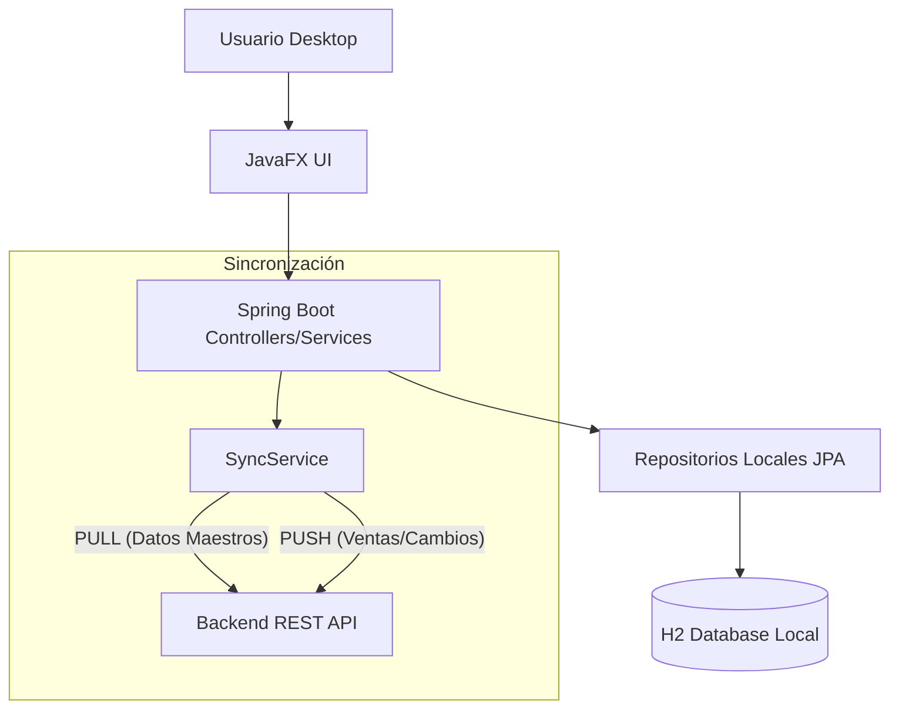

# Arquitectura Desktop: Offline-First & Sincronización

Este documento describe la arquitectura técnica de la aplicación de escritorio (`apps/desktop`), la cual ha evolucionado de un Cliente Ligero a un sistema **Híbrido (Spring Boot + JavaFX) con capacidad Offline**.

## 1. Topología del Sistema

## 2. Componentes Clave

### A. Persistencia Local (H2)
Utilizamos H2 en modo archivo (`jdbc:h2:file:${user.home}/.dismal/data/local_db`).
- **Ventaja:** Permite operar sin internet.
- **Configuración:** `AUTO_SERVER=TRUE` para evitar bloqueos de archivos si la app se cierra inesperadamente.

### B. SyncService (El "Cerebro")
Es el servicio responsable de mantener la coherencia entre la nube y el local.
- **Estrategia Actual (V1):** Full Reload. Borra/Sobrescribe o actualiza entidades locales basándose en la respuesta de la API.
- **Trigger:** Manual (Botón "Sync") o al inicio de la aplicación.

### C. Mapeo de Datos (DTO vs Entity)
- **API (Nube):** Expone DTOs (`Product`, `License`).
- **Local (Desktop):** Usa Entidades JPA (`LocalProduct`, `LocalLicense`) optimizadas para la persistencia en H2.
- **Conversión:** Ocurre dentro de `SyncService` y en los Controladores de Vista.

## 3. Flujos de Usuario

### Flujo de Venta (Offline)
1. Usuario crea venta en UI.
2. App guarda `LocalOrder` en H2 con estado `PENDING_SYNC`.
3. App descuenta stock localmente (Optimistic UI).
4. Cuando hay internet -> `SyncService` envía `LocalOrder` a la API.
5. Si API acepta -> `LocalOrder` pasa a `SYNCED`.
6. Si API rechaza (ej: sin stock real) -> `LocalOrder` pasa a `ERROR` y se notifica al usuario.

### Flujo de Actualización (PULL)
1. Usuario presiona "Sync".
2. App descarga Catálogo, Licencias y Metas.
3. Se actualiza H2.
4. UI se refresca vía `Platform.runLater`.

## 4. Paridad con Web (Diferencias)

| Funcionalidad | Web | Desktop | Notas Desktop |
|---|---|---|---|
| **Listados** | Paginación en servidor | Paginación local o Scroll infinito | Carga todo en memoria si el dataset es pequeño (<5k filas). |
| **Búsqueda** | SQL `LIKE` en servidor | Filtros Java Streams | Muy rápido, pero requiere tener los datos sincronizados. |
| **Validación** | Zod / Backend | JavaFX Bindings | Se deben replicar las reglas de negocio del backend. |

## 5. Roadmap de Mejoras

1. **Sincronización Delta:** Enviar parámetro `?since={lastSyncDate}` a la API para descargar solo lo nuevo.
2. **Conflict Resolution:** Interfaz para resolver conflictos cuando un dato cambió en local y en nube simultáneamente.
3. **Background Sync:** Hilo demonio que sincroniza cada 5 minutos si hay conexión.
