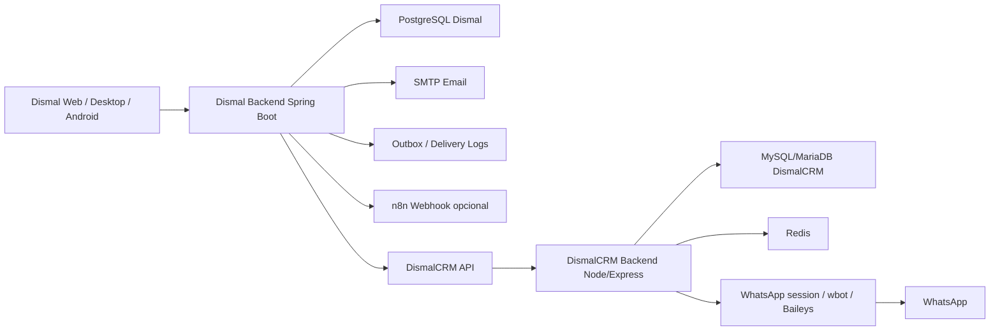
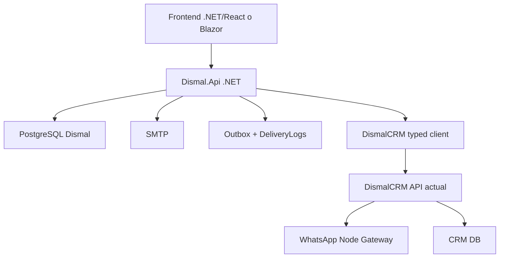

# Manual tecnico de Dismal y DismalCRM para migracion a Visual Studio .NET

Fecha de referencia: 2026-04-30

Este documento describe la arquitectura real de los dos proyectos, sus responsabilidades, sus puntos de conexion y una ruta tecnica recomendada para migrarlos a una plataforma .NET sin romper los flujos criticos de ventas, licencias, email y WhatsApp.

## 1. Resumen ejecutivo

### Dismal

Dismal es el sistema principal de negocio. Administra clientes, productos, licencias, ventas, cuentas por cobrar, facturas, reportes, integraciones, plantillas de notificacion, outbox, sincronizacion con CRM y WooCommerce.

Stack actual:

- Backend: Java 21, Spring Boot 3.2.5, Spring Security, Spring Data JPA, Flyway, PostgreSQL.
- Web admin: Next.js 14, React 18, TypeScript, Tailwind, SWR, Zustand.
- Desktop: JavaFX.
- Android: Kotlin/Gradle.
- Base de datos: PostgreSQL.
- Contenedores: Docker Compose.

### DismalCRM

DismalCRM es el sistema de mensajeria y atencion por WhatsApp. Gestiona conexiones WhatsApp, contactos, tickets, mensajes, colas, usuarios, campanas, remitentes y envio programado. Dismal lo usa como gateway de WhatsApp.

Stack actual:

- Backend: Node.js, TypeScript, Express, Sequelize, Socket.IO.
- Frontend: React 16, Vite, Material UI 4.
- WhatsApp: whatsapp-web.js/Baileys y persistencia de sesion en volumen.
- Base de datos: MariaDB/MySQL por defecto, con soporte parcial por variables para PostgreSQL.
- Redis: usado para cache/colas/limites.
- Contenedores: Docker Compose.

## 2. Regla critica de arquitectura

La conexion de WhatsApp no debe vivir dentro de Dismal mientras exista DismalCRM como gateway. Dismal debe seguir siendo el sistema de negocio y DismalCRM debe seguir siendo el adaptador de WhatsApp.

Regla recomendada para la migracion:

- Migrar primero Dismal a .NET manteniendo la API de DismalCRM intacta.
- No tocar la logica interna de sesiones WhatsApp, QR, wbot, Baileys, tickets o escucha de mensajes sin una etapa separada.
- Mantener estable el contrato HTTP entre Dismal y DismalCRM.
- Agregar observabilidad y logs antes de cambiar comportamiento.

## 3. Diagrama de conexion actual



## 4. Conexion entre Dismal y DismalCRM

### Configuracion en Dismal

Variables relevantes:

```env
DISMAL_CRM_ENABLED=true
DISMAL_CRM_BASE_URL=http://62.171.142.234:8080
DISMAL_CRM_API_TOKEN=TOKEN_CONFIGURADO_EN_DISMALCRM
DISMAL_CRM_WHATSAPP_ENABLED=true
DISMAL_CRM_WHATSAPP_ID=ID_DE_LA_CONEXION_WHATSAPP
```

Estas variables se mapean en Spring:

```properties
integrations.dismal-crm.enabled
integrations.dismal-crm.base-url
integrations.dismal-crm.api-token
integrations.dismal-crm.whatsapp-enabled
integrations.dismal-crm.whatsapp-id
```

### Cliente actual en Dismal

Clase principal:

```text
src/main/java/com/dismal/dismal/modules/integrations/crm/service/DismalCrmGateway.java
```

Endpoints consumidos:

| Uso | Metodo | Endpoint DismalCRM |
| --- | --- | --- |
| Crear cliente de campana | POST | `/api/campaign-clients` |
| Actualizar cliente de campana | PUT | `/api/campaign-clients/{id}` |
| Eliminar cliente de campana | DELETE | `/api/campaign-clients/{id}` |
| Buscar cliente de campana | GET | `/api/campaign-clients?searchParam=...&pageNumber=1` |
| Enviar WhatsApp | POST | `/api/messages/send` |

Autenticacion:

```http
Authorization: Bearer {DISMAL_CRM_API_TOKEN}
```

### Endpoint critico en DismalCRM

Ruta:

```text
backend/src/routes/apiRoutes.ts
POST /api/messages/send
```

Controlador:

```text
backend/src/controllers/ApiController.ts
```

Middleware:

```text
backend/src/middleware/isAuthApi.ts
```

Payload esperado:

```json
{
  "number": "593999999999",
  "body": "Mensaje a enviar",
  "whatsappId": 1
}
```

El token se valida contra `Setting` mediante `ListSettingByValueService`. Por eso el token que usa Dismal debe existir en la tabla/configuracion de DismalCRM.

## 5. Modulos funcionales de Dismal

| Modulo | Responsabilidad |
| --- | --- |
| `security` | Usuarios, roles, clientes, autenticacion JWT. |
| `admin` | Administracion de usuarios, importacion, exportacion, reset de claves. |
| `store` | Productos/software, licencias, stock, metas comerciales historicas. |
| `pricing` | Listas de precios y catalogo publico. |
| `sales` | Cotizaciones, ventas, pagos, facturas, cuentas por cobrar, confirmacion de venta y entrega de licencias. |
| `reports` | Reportes, listas de precio, rentabilidad, clientes inactivos, alertas de inventario. |
| `dashboard` | KPIs administrativos, ventas recientes, AR, outbox, metas. |
| `expenses` | Gastos y resumenes. |
| `planning` | Metas de ventas, costos fijos, costo real de activacion. |
| `marketing` | Campanas, inteligencia de marketing, acciones estrategicas. |
| `integrations` | CRM, WooCommerce, SMTP, plantillas, outbox, delivery logs, n8n. |

## 6. Modulos funcionales de DismalCRM

| Modulo | Responsabilidad |
| --- | --- |
| `WhatsApp/WbotServices` | Conexion WhatsApp, validacion de numeros, envio de texto/media, QR, sesiones. |
| `TicketServices` | Creacion y gestion de tickets por contacto. |
| `MessageServices` | Persistencia y consulta de mensajes. |
| `ContactServices` | Contactos, busqueda, creacion y actualizacion. |
| `CampaignServices` | Campanas, destinatarios, worker, preview, metricas. |
| `CampaignClientServices` | Clientes importados desde Dismal para campanas. |
| `QueueService` | Colas de atencion. |
| `UserServices/AuthServices` | Usuarios, autenticacion JWT y refresh token. |
| `SettingServices` | Configuraciones, incluido token API. |
| `Socket.IO` | Eventos en tiempo real para chats, tickets y notificaciones. |

## 7. Flujos criticos actuales

### 7.1 Venta confirmada y envio de licencia

Flujo:

1. Usuario confirma una venta en Dismal.
2. Dismal asigna licencias disponibles.
3. Dismal crea evento outbox `LICENSE_DELIVERED`.
4. Dismal envia email si el canal esta habilitado.
5. Dismal envia WhatsApp usando `DismalCrmGateway`.
6. Se registran resultados en `notification_delivery_logs`.
7. El UI muestra estado real: enviado, fallo, pendiente o no enviado.

Puntos que deben preservarse en .NET:

- Confirmacion de venta debe ser transaccional.
- Asignacion de licencia no debe duplicarse.
- Envio de email/WhatsApp debe registrar resultado por canal.
- Error de WhatsApp no debe revertir la venta si la venta ya fue confirmada, salvo que se defina una regla explicita.
- El outbox debe permitir reintento.

### 7.2 Cuentas por cobrar y recordatorios

Flujo:

1. Usuario entra a AR vencido o por vencer.
2. Presiona boton de recordar/notificar.
3. Dismal genera o reutiliza evento `AR_OVERDUE`.
4. Dismal envia email con plantilla `AR_OVERDUE` si aplica.
5. Dismal envia WhatsApp por DismalCRM si aplica.
6. Se registra log por canal.

Puntos que deben preservarse:

- No enviar sin cliente valido.
- No enviar WhatsApp sin telefono valido.
- No enviar email sin SMTP configurado y email de cliente.
- Registrar `SENT` o `FAILED` por canal.

### 7.3 Lista de precios desde productos/reportes

Flujo:

1. Usuario genera lista de precios.
2. Puede enviarla por email, WhatsApp o ambos.
3. Se usan plantillas `PRICE_LIST_SHARED`.
4. El WhatsApp sale por DismalCRM.
5. Email sale por SMTP de Dismal.

Puntos que deben preservarse:

- Buscar cliente desde base de datos para autocompletar nombre, email y telefono.
- Mostrar mensaje flotante de exito/error.
- No mostrar error falso cuando el envio fue correcto.

### 7.4 Campanas y notificaciones masivas

Hay dos enfoques:

- DismalCRM tiene motor de campanas propio.
- Dismal tiene marketing/outbox y clientes sincronizables con CRM.

Recomendacion para .NET:

- Mantener campanas masivas inicialmente en DismalCRM.
- En .NET, crear solo una capa de orquestacion desde Dismal: seleccionar segmento, crear/sincronizar clientes y ordenar campana.
- Migrar el motor de campanas despues de estabilizar ventas, AR, email y WhatsApp.

## 8. Base de datos actual

### Dismal

Base: PostgreSQL.

Migraciones:

```text
src/main/resources/db/migration
```

Herramienta: Flyway.

Tablas/areas principales:

- Usuarios, clientes y roles.
- Productos/software.
- Licencias.
- Ventas, items, pagos.
- Facturas.
- Cuentas por cobrar.
- Gastos.
- Metas de ventas.
- Integraciones y settings.
- Plantillas de notificacion.
- Outbox events.
- Delivery logs.
- WooCommerce sync.

### DismalCRM

Base: MariaDB/MySQL por defecto.

Migraciones:

```text
backend/src/database/migrations
```

Herramienta: Sequelize CLI.

Modelos principales:

- `User`, `Company`, `Setting`
- `Whatsapp`, `Baileys`, `WppKey`
- `Contact`, `ContactCustomField`
- `Ticket`, `TicketTraking`, `TicketTag`, `TicketNote`
- `Message`
- `Queue`, `QueueOption`
- `Campaign`, `CampaignRecipient`, `CampaignClient`, `CampaignShipping`
- `Sender`, `OutboxMessage`
- `Chat`, `ChatMessage`, `ChatUser`

## 9. Equivalencia recomendada en .NET

### Backend Dismal

| Java/Spring actual | .NET recomendado |
| --- | --- |
| Spring Boot Web | ASP.NET Core Web API |
| Spring Security + JWT | ASP.NET Core Authentication/JWT Bearer |
| Spring Data JPA | Entity Framework Core |
| Flyway | EF Core Migrations o FluentMigrator |
| WebClient | IHttpClientFactory + typed clients |
| @Scheduled | BackgroundService / Quartz.NET / Hangfire |
| @Transactional | EF Core transaction / TransactionScope |
| Java records DTO | C# records |
| Controllers REST | Minimal APIs o Controllers; recomendado Controllers por claridad de modulos |
| Services | Application Services |
| Repositories JPA | EF Core DbContext + repositorios solo donde agreguen valor |

### Backend DismalCRM

| Node/Express actual | .NET recomendado |
| --- | --- |
| Express routes/controllers | ASP.NET Core Controllers |
| Sequelize models | EF Core entities |
| Sequelize migrations | EF Core migrations |
| Socket.IO | SignalR |
| Redis/ioredis | StackExchange.Redis |
| whatsapp-web.js/Baileys | Mantener Node como microservicio inicialmente |
| Workers de campanas | BackgroundService / Hangfire |
| JWT/refresh | ASP.NET Core Identity o JWT propio |

Recomendacion fuerte:

No migrar el motor de WhatsApp a .NET en la primera fase. WhatsApp Web/Baileys vive mejor inicialmente como servicio Node aislado, porque ya funciona y depende de librerias especificas del ecosistema Node. La primera meta debe ser que .NET consuma el mismo gateway HTTP.

## 10. Arquitectura objetivo recomendada



Solucion .NET sugerida:

```text
DismalNet.sln
  src/
    Dismal.Api/
    Dismal.Application/
    Dismal.Domain/
    Dismal.Infrastructure/
    Dismal.Contracts/
  tests/
    Dismal.UnitTests/
    Dismal.IntegrationTests/
```

Para CRM:

```text
DismalCrmNet.sln
  src/
    DismalCrm.Api/
    DismalCrm.Application/
    DismalCrm.Domain/
    DismalCrm.Infrastructure/
    DismalCrm.WhatsAppGateway.Node/   # inicialmente wrapper/documentacion, no migracion directa
```

## 11. Estrategia de migracion por fases

### Fase 0: Congelar contratos

Objetivo: documentar y proteger las APIs actuales.

Acciones:

- Exportar OpenAPI/Swagger de Dismal.
- Documentar payloads reales de DismalCRM `/api/messages/send` y `/api/campaign-clients`.
- Crear pruebas de contrato sin enviar mensajes reales.
- Definir entorno staging con WhatsApp de prueba antes de tocar produccion.

Resultado esperado:

- Ningun cambio funcional.
- Contratos HTTP bloqueados.

### Fase 1: Migrar nucleo de Dismal a .NET

Prioridad:

1. Auth/JWT.
2. Usuarios/clientes.
3. Productos/licencias.
4. Ventas/pagos/facturas.
5. Cuentas por cobrar.
6. Email SMTP.
7. Outbox y delivery logs.
8. Cliente HTTP hacia DismalCRM.

No migrar en esta fase:

- WhatsApp interno de DismalCRM.
- Campanas masivas avanzadas.
- Desktop/Android.

### Fase 2: Reemplazar backend Java en produccion

Acciones:

- Ejecutar .NET contra una copia de PostgreSQL.
- Comparar endpoints y respuestas con el backend Java.
- Migrar primero lectura, luego escritura.
- Activar feature flags por modulo.
- Mantener rollback al backend Java.

### Fase 3: Migrar frontend administrativo

Opciones:

- Mantener Next.js y consumir API .NET.
- Migrar a Blazor si se quiere ecosistema 100% .NET.

Recomendacion:

Mantener Next.js al inicio. Cambiar frontend y backend al mismo tiempo aumenta demasiado el riesgo.

### Fase 4: CRM .NET parcial

Migrar partes no criticas:

- Usuarios.
- Contactos.
- Campanas.
- Reportes.
- Configuraciones.

Mantener Node para:

- Sesiones WhatsApp.
- QR.
- Recepcion de mensajes.
- Envio de mensajes.
- Media.

### Fase 5: Decidir futuro del motor WhatsApp

Opciones:

1. Mantener Node permanente como microservicio de WhatsApp.
2. Usar proveedor oficial WhatsApp Cloud API.
3. Investigar libreria .NET, solo si tiene estabilidad comprobada.

Recomendacion profesional:

Para produccion seria, migrar a WhatsApp Cloud API cuando el negocio lo permita. Mientras tanto, aislar Node como gateway.

## 12. Contratos .NET sugeridos

### Typed client para DismalCRM

```csharp
public sealed record SendWhatsAppMessageRequest(
    string Number,
    string Body,
    int? WhatsappId
);

public interface IDismalCrmClient
{
    Task SendWhatsAppMessageAsync(SendWhatsAppMessageRequest request, CancellationToken ct);
}
```

Implementacion:

```csharp
public sealed class DismalCrmClient : IDismalCrmClient
{
    private readonly HttpClient _httpClient;

    public DismalCrmClient(HttpClient httpClient)
    {
        _httpClient = httpClient;
    }

    public async Task SendWhatsAppMessageAsync(SendWhatsAppMessageRequest request, CancellationToken ct)
    {
        using var response = await _httpClient.PostAsJsonAsync("/api/messages/send", request, ct);
        response.EnsureSuccessStatusCode();
    }
}
```

Registro:

```csharp
services.AddHttpClient<IDismalCrmClient, DismalCrmClient>((sp, client) =>
{
    var options = sp.GetRequiredService<IOptions<DismalCrmOptions>>().Value;
    client.BaseAddress = new Uri(options.BaseUrl.TrimEnd('/'));
    client.DefaultRequestHeaders.Authorization =
        new AuthenticationHeaderValue("Bearer", options.ApiToken);
});
```

### Resultado de notificacion

```csharp
public sealed record NotificationSendResult(
    bool Sent,
    string Message
);
```

### Delivery log

Campos minimos:

```text
Id
OutboxEventId
Channel: EMAIL | WHATSAPP
Status: PENDING | SENT | DELIVERED | FAILED | NOT_SENT
ProviderMessageId
Error
CreatedAt
UpdatedAt
```

## 13. Feature flags necesarios

Para evitar romper produccion:

```json
{
  "Integrations": {
    "DismalCrm": {
      "Enabled": true,
      "BaseUrl": "http://62.171.142.234:8080",
      "ApiToken": "...",
      "WhatsappEnabled": true,
      "WhatsappId": 1
    },
    "Outbox": {
      "DispatchEnabled": true,
      "MaxAttempts": 10
    },
    "Smtp": {
      "Enabled": true
    }
  }
}
```

Reglas:

- Si `WhatsappEnabled=false`, no intentar enviar WhatsApp.
- Si `Smtp.Enabled=false`, no intentar email.
- Si falla un canal, registrar fallo y continuar con los otros canales.
- No ocultar errores: mostrarlos en delivery logs.

## 14. Riesgos principales

| Riesgo | Impacto | Mitigacion |
| --- | --- | --- |
| Cambiar contrato `/api/messages/send` | Se rompe WhatsApp desde Dismal | Congelar payload y token. |
| Migrar WhatsApp directo a .NET sin pruebas | Perdida de conexion/QR/sesion | Mantener Node como gateway. |
| No migrar delivery logs | UI mostrara errores falsos | Crear tabla equivalente en .NET. |
| No preservar outbox | Envios duplicados o perdidos | Idempotency key por evento. |
| Migrar DB sin comparar datos | Ventas/licencias inconsistentes | Pruebas de reconciliacion. |
| Cambiar frontend y backend juntos | Dificil diagnostico | Migracion por capas. |
| Usar produccion para pruebas | Mensajes basura a clientes | Staging y mocks. |

## 15. Checklist antes de iniciar migracion

- Backup completo de PostgreSQL de Dismal.
- Backup completo de MySQL/MariaDB de DismalCRM.
- Backup de volumen `.wwebjs_auth`.
- Backup de `backend/public` de DismalCRM.
- Copia de `.env` de ambos proyectos.
- Lista de IDs de conexiones WhatsApp activas.
- Token API actual de DismalCRM.
- SMTP validado.
- Usuario de prueba interno con email y WhatsApp controlado.
- Ambiente staging con dominios/puertos separados.

## 16. Checklist de pruebas sin generar basura

Pruebas seguras:

- Validar login con usuario interno.
- Crear venta en base staging.
- Confirmar venta con cliente de prueba.
- Enviar WhatsApp a numero controlado.
- Enviar email a correo controlado.
- Revisar delivery logs.
- Simular fallo de CRM apagando feature flag, no desconectando WhatsApp.
- Probar AR vencido con cliente de prueba.
- Probar lista de precios con cliente de prueba.

No hacer en produccion:

- Crear ventas falsas.
- Enviar campanas masivas.
- Borrar sesiones WhatsApp.
- Regenerar QR si la conexion actual funciona.
- Ejecutar migraciones sin backup.

## 17. Orden recomendado de trabajo para Visual Studio/.NET

1. Crear solucion .NET limpia.
2. Crear proyectos Domain, Application, Infrastructure y Api.
3. Configurar PostgreSQL con EF Core.
4. Mapear entidades principales: User, Customer, Software, License, Sale, SaleItem, Payment, Invoice, AccountsReceivable.
5. Implementar JWT.
6. Implementar endpoints compatibles con `/api/v1`.
7. Implementar SMTP.
8. Implementar outbox y delivery logs.
9. Implementar `IDismalCrmClient`.
10. Implementar confirmacion de venta y envio de licencias.
11. Implementar AR reminders.
12. Implementar lista de precios.
13. Conectar frontend existente a API .NET.
14. Comparar respuestas endpoint por endpoint.
15. Desplegar por feature flags.

## 18. Tabla de prioridades para migracion

| Prioridad | Modulo | Motivo |
| --- | --- | --- |
| 1 | Auth/clientes | Base de seguridad y datos. |
| 2 | Productos/licencias | Inventario critico. |
| 3 | Ventas/pagos | Core de negocio. |
| 4 | Email/WhatsApp via CRM | Flujo operativo diario. |
| 5 | AR | Cobranza y recordatorios. |
| 6 | Reportes/lista de precios | Operacion comercial. |
| 7 | Integraciones WooCommerce/n8n | Automatizacion externa. |
| 8 | Marketing/campanas | Alto riesgo, migrar despues. |
| 9 | CRM WhatsApp interno | Ultima fase o mantener Node. |

## 19. Observabilidad minima en .NET

Agregar logs estructurados:

- `saleId`
- `clientId`
- `outboxEventId`
- `channel`
- `destination`
- `provider`
- `httpStatus`
- `errorCode`
- `elapsedMs`

Agregar health checks:

- Base de datos.
- SMTP configurado.
- DismalCRM reachable.
- Redis si se migra CRM.
- Outbox pending/failed count.

Endpoints recomendados:

```text
GET /health
GET /health/ready
GET /api/v1/integrations/status
GET /api/v1/integrations/outbox
GET /api/v1/integrations/notifications/templates
GET /api/v1/integrations/notifications/delivery-logs
```

## 20. Decision tecnica recomendada

La migracion mas segura no es reescribir todo de una vez. La ruta profesional es:

1. Convertir Dismal backend a .NET primero.
2. Mantener DismalCRM como gateway WhatsApp.
3. Mantener Next.js inicialmente.
4. Migrar CRM por modulos no criticos.
5. Dejar WhatsApp Node aislado o reemplazarlo por proveedor oficial cuando sea viable.

Esta estrategia reduce el riesgo de romper WhatsApp, conserva las ventas y permite avanzar hacia Visual Studio/.NET con control.
