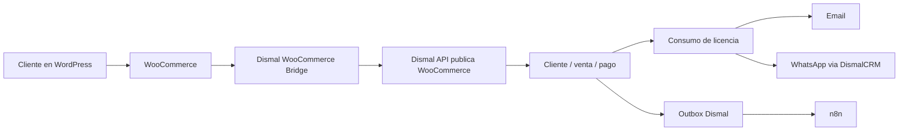
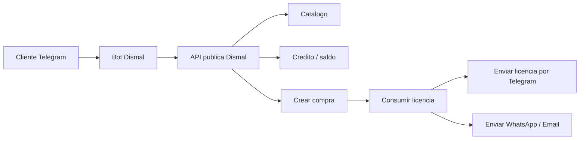

# Manual tecnico - WordPress, WooCommerce, n8n y Dismal

## Objetivo

Este manual deja documentada la integracion profesional para que el sitio WordPress venda licencias digitales usando WooCommerce y consuma el inventario real de `Dismal`.

La regla principal es que `Dismal` sigue siendo la fuente maestra de clientes, productos, ventas, licencias, credito y cuentas por cobrar. WordPress funciona como tienda visible para el cliente.

## Arquitectura recomendada



## Componentes

### WordPress

Plugin oficial:

```text
apps/wordpress/dismal-woocommerce-bridge
```

Responsabilidades:

- guardar la URL del backend `Dismal`
- guardar la clave de integracion
- mapear productos WooCommerce con productos `Software` de Dismal
- enviar ordenes pagadas a Dismal
- guardar `saleId` en la orden WooCommerce
- importar clientes desde Dismal
- permitir compra con `Credito Dismal`
- probar conexion desde el panel de WooCommerce

### Dismal

Endpoint principal:

```http
POST /api/public/integrations/woocommerce/order-paid
```

Endpoint auxiliar:

```http
GET /api/public/integrations/woocommerce/customers
```

Seguridad:

```http
X-Dismal-Integration-Key: <WOOCOMMERCE_API_KEY>
```

### DismalCRM

No se toca directamente desde WordPress.

El flujo correcto es:

```text
WordPress -> Dismal -> DismalCRM
```

Asi se evita romper WhatsApp. Dismal confirma la venta, consume licencia y usa su integracion ya existente con DismalCRM para enviar mensajes.

### n8n

n8n debe escuchar eventos de Dismal por el outbox:

```text
Dismal Outbox -> Webhook n8n
```

No recomiendo que WordPress llame a n8n para crear ventas. Eso duplicaria reglas de negocio.

## Variables de entorno en VPS

En `/root/Dismal/.env`:

```env
WOOCOMMERCE_API_KEY=clave-larga-segura
N8N_WEBHOOK_URL=https://tu-n8n.com/webhook/dismal-events
N8N_SECRET=clave-secreta-outbox

DISMAL_CRM_ENABLED=true
DISMAL_CRM_BASE_URL=http://62.171.142.234:8080
DISMAL_CRM_API_TOKEN=token-configurado
DISMAL_CRM_WHATSAPP_ENABLED=true
DISMAL_CRM_WHATSAPP_ID=34
```

Despues de cambiar variables:

```bash
cd /root/Dismal
docker compose up -d --build backend
docker compose logs backend --since=5m
```

## Instalacion del plugin WordPress

1. Copiar la carpeta:

```text
Dismal/apps/wordpress/dismal-woocommerce-bridge
```

a:

```text
wp-content/plugins/dismal-woocommerce-bridge
```

2. Activar el plugin en WordPress.

3. Ir a:

```text
WooCommerce > Dismal Bridge
```

4. Configurar:

```text
API Base URL: https://tu-dominio-dismal.com
Integration Key: mismo valor de WOOCOMMERCE_API_KEY
Paid Order Statuses: processing, completed
Default Customer Type: FINAL
Distributor WordPress Roles: roles mayoristas si aplica
Payment Method Map: mapear pasarelas a CASH, TRANSFER, CARD o CREDIT
```

5. Presionar:

```text
Probar conexion con Dismal
```

Resultado correcto:

```text
Conexion correcta con Dismal. Clientes disponibles: X.
```

## Mapeo de productos

Cada producto WooCommerce que venda licencias debe tener:

```text
Dismal Software ID
```

Ese valor es el UUID del producto/software en Dismal.

Ejemplo:

```text
Producto WooCommerce: ESET Home Essential Security 1 ano
Dismal Software ID: 11111111-1111-1111-1111-111111111111
```

Si falta este campo, el plugin no sincroniza la orden y deja error en la orden WooCommerce.

## Flujo de compra contado

1. Cliente compra en WordPress.
2. WooCommerce cambia la orden a `processing` o `completed`.
3. El plugin construye el payload.
4. Dismal recibe `/order-paid`.
5. Dismal crea o actualiza cliente.
6. Dismal crea venta tipo `CASH`.
7. Dismal confirma venta.
8. Dismal registra pago.
9. Dismal consume licencia.
10. Dismal envia email y WhatsApp.
11. WooCommerce guarda `_dismal_sale_id`.

Nota tecnica: el puente envia a Dismal el total de los productos digitales sincronizados, no el total completo de WooCommerce con envio o impuestos. Para licencias digitales se recomienda usar productos virtuales sin envio y mantener impuestos/descuentos alineados con Dismal para evitar diferencias de validacion.

## Flujo de compra con credito

1. Primero importar clientes desde Dismal.
2. El cliente inicia sesion en WordPress.
3. Si tiene credito activo y disponible, aparece la pasarela `Credito Dismal`.
4. El cliente confirma compra.
5. WooCommerce pone la orden en `processing`.
6. El plugin envia venta tipo `CREDIT`.
7. Dismal confirma venta, consume licencia y abre AR.
8. Dismal envia licencia.

## Metadatos de orden

El plugin guarda:

```text
_dismal_external_order_id
_dismal_sale_id
_dismal_sync_status
_dismal_sync_message
_dismal_last_sync_at
```

Estados esperados:

```text
pending
synced
duplicated
error
```

## Reintento manual

En la ficha de la orden WooCommerce aparece:

```text
Dismal Sync
```

Acciones:

```text
Retry Sync
Sync Customer
```

`Retry Sync` fuerza un nuevo envio. Dismal mantiene idempotencia por `orderId`, por lo que no debe duplicar ventas si la orden ya fue recibida.

## Validacion en Dismal

Despues de una compra:

1. Ir a `Operaciones > Ventas`.
2. Confirmar que existe la venta.
3. Verificar que el cliente sea correcto.
4. Verificar que el pago este registrado si fue contado.
5. Verificar que AR quede abierto si fue credito.
6. Verificar envio por email y WhatsApp.

## Validacion en DismalCRM

No se debe crear ticket por cada compra.

El envio de licencia debe ir por la logica actual de Dismal hacia DismalCRM:

```text
Dismal -> DismalCRM /api/messages/send
```

Si falla WhatsApp, revisar en Dismal:

```bash
cd /root/Dismal
docker compose logs backend --since=10m
```

Y en DismalCRM:

```bash
cd /root/DismalCRM
docker compose logs backend --since=10m
```

## n8n

Configurar en Dismal:

```text
Integraciones > Settings > Webhook URL
```

o por variable:

```env
N8N_WEBHOOK_URL=https://tu-n8n.com/webhook/dismal-events
```

n8n debe recibir eventos de negocio:

```text
SALE_CONFIRMED
LICENSES_DELIVERED
PAYMENT_RECEIVED
AR_OVERDUE
CAMPAIGN_SENT
```

Uso recomendado:

- reportes automaticos
- alertas internas por Telegram
- auditoria de ventas
- seguimiento comercial

No recomendado:

- crear ventas desde n8n si WooCommerce ya las envio
- enviar licencias desde n8n saltandose Dismal
- llamar directamente a DismalCRM desde WordPress

## Bot Telegram para clientes

La opcion del bot tipo tienda es viable, pero debe consumir una API publica de Dismal, no WooCommerce.

Flujo recomendado:



Endpoints que conviene crear antes del bot:

```http
POST /api/public/client/auth/request-code
POST /api/public/client/auth/verify-code
GET  /api/public/client/catalog
GET  /api/public/client/me/credit
POST /api/public/client/purchases
GET  /api/public/client/licenses
```

## App movil cliente

La app Android actual es administrativa. Para clientes finales recomiendo una app separada:

```text
Dismal Cliente
```

Funciones:

- login por email/codigo
- catalogo
- saldo/credito
- compra de licencias
- historial de licencias
- soporte WhatsApp

La app y el bot deben reutilizar la misma API publica.

## Pruebas antes de produccion

1. Producto sin `Dismal Software ID`: debe fallar y dejar nota en WooCommerce.
2. Orden contado: debe crear venta y pago.
3. Orden credito: debe crear venta y AR.
4. Reintentar orden: no debe duplicar venta.
5. Cliente nuevo: debe crearse en Dismal.
6. Cliente existente: debe actualizar datos sin duplicar.
7. WhatsApp desconectado: la venta no debe romperse, solo fallar la notificacion.
8. n8n apagado: la venta no debe romperse, solo fallar outbox/reintento.

## Checklist de go-live

- `WOOCOMMERCE_API_KEY` configurado en VPS.
- Plugin activo en WordPress.
- Prueba de conexion exitosa.
- Productos WooCommerce mapeados con `Dismal Software ID`.
- Clientes importados si se usara credito.
- Pasarela `Credito Dismal` activada solo si aplica.
- Compra de prueba contado exitosa.
- Compra de prueba credito exitosa.
- Logs limpios en Dismal.
- WhatsApp conectado en DismalCRM.
- n8n webhook activo si se usara automatizacion.
